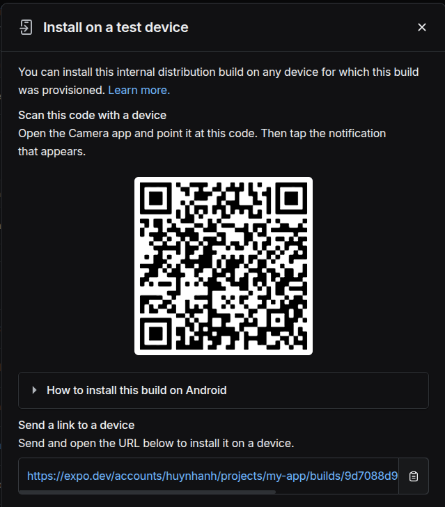

# Hướng Dẫn Clone và Chạy Dự Án Expo

## Yêu Cầu Môi Trường

Để chạy được dự án, cần đảm bảo môi trường phát triển có các yêu cầu sau:

- **Node.js** phiên bản **v22.12.0**
- **Git** để clone repository
- **Expo CLI** và **EAS CLI**
- **Thiết bị Android hoặc trình giả lập**

## Hướng Dẫn Cài Đặt

### 1. Clone repository

```sh
git clone <repository-url>
cd <project-folder>
```

### 2. Cài đặt các dependencies

```sh
npm install
```
### 3. Truy cập link trên smart phone hoặc máy ảo mobile gòi tải file về và cài đặt như cài đặt app bình thường:
https://expo.dev/accounts/huynhanh/projects/my-app/builds/9d7088d9-260f-44db-ac73-ce05e78698bf
hoặc quét mã QR:


### 4. Sau đó chạy lệnh: 

```sh
    npm start
```

### 5. Sau khi chạy được dự án thành công thì vào file trong dự án: 
app/(tabs)/index.tsx
Tìm chỗ "Wellcom Huynh Anh!" sữa lại thành tên các bạn sao đó nhấn Ctrl + S và xem trên giao diện có được cập nhật lại không.

### 6. Nếu phát sinh lỗi thì liên hệ: Huỳnh Vũ Khang để được hưỡng dẫn tận tâm tình luôn!


